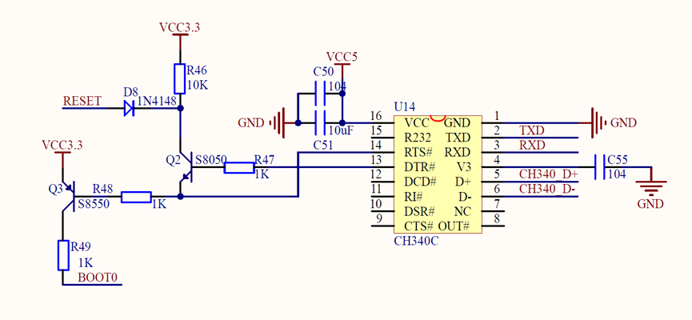

# McuDownLoaderForCortex-M

1、	按下下载按钮

    连接对应串口，串口设置：8n1+偶校验

2、控制CH340通过RTS，DTR引脚进入系统BootLoader（使用系统ISP硬件必须支持如图1）

    2.1：拉高BOT0，RTS=0
    2.2：拉低RESET，DTR=1
    2.3：拉高RESET，DTR=0，进入系统ISP
    Tips：此步骤：使用系统ISP需要，用户实现IAP则不需要。
    Tips：用户IAP需要手动进入，按按钮再上电进入BootLoader模式。
    Tips：用户IAP即用户实现的BootLoader程序，用与系统BootLoader一样的下载协议。

3、从机波特率匹配

    3.1：发送0x7F
    3.2：接收ACK，如果不为ACK或超时重发，错误五次跳到失败（ACK=0x79,NACK=0x1F）

4、	取消读保护

    4.1：发送0x92 0x6D
    4.2：接收ACK，不为ACK或超时重发，错误五次跳到失败
    4.3：重新执行第3步

    使能读保护：（不需要）
    4.1：发送0x82 0x7D
    4.2：接收ACK，不为ACK或超时重发，错误五次跳到失败
    4.3：重新执行第3步

5、	取消写保护

    5.1：发送0x73 0x8C
    5.2：接收ACK，不为ACK或超时重发，错误五次跳到失败
    5.3：重新执行第3步

    使能写保护：（不需要）
    5.1：发送0x63 0x9C
    5.2：接收ACK，不为ACK或超时重发，错误五次跳到失败
    5.3：重新执行第3步

6、获取支持命令

	6.1：发送0x00 0xFF
    6.2：接收ACK，不为ACK或超时重发，错误五次跳到失败
    6.3：接收字节数N+版本（0x21代表2.1版本）+支持的指令列表
    6.4：接收ACK/NACK，不为ACK/NACK或超时跳到失败。

7、发送0x02 0xFD（获取PID）

    7.1：接收字节数N+PID （高位在前低位在后）
    7.2：接收ACK/NACK，不为ACK/NACK或超时跳到失败。

8、读MCU信息： 

	8.1：发送0x11 0xEE（读flash）
    8.2：接收ACK，不为ACK或超时重发，错误五次跳到失败
    8.3：发送4 bytes地址+1 byte地址异或
    8.4：接收ACK，不为ACK或超时跳到失败。
    8.5：发送读取字节数量N+字节数量反码（实际读取数量为N+1）
    8.6：接收ACK +读取到的数据，不为ACK或超时跳到失败。

9、全片擦除：

	新版指令：
	9.1：发送0x44 0xBB
    9.2：接收ACK，不为ACK或超时重发，错误五次跳到失败
    9.3：发送0xFF 0xFF 0x00
    9.4：接收ACK，不为ACK或超时跳到失败

    旧版指令：
    9.1：发送0x43 0xBC
    9.2：接收ACK，不为ACK或超时重发，错误五次跳到失败
    9.3：发送0xFF 0x00
    9.4：接收ACK，不为ACK或超时跳到失败

10、写flash：

	10.1：打开xx.bin文件
	10.2：发送0x31 0xCE（写flash）
    10.3：接收ACK，不为ACK或超时重发，错误五次跳到失败
	10.4：发送4 bytes起始地址0x08 00 00 00 + 1 byte地址的异或
    10.4：接收ACK，不为ACK或超时跳到失败
    10.5：N字节数1byte + bin文件N bytes +包含以上载体的异或1 byte
    10.6：接收ACK，不为ACK或超时跳到失败
    10.7：循环10.2到10.6步骤，直到.bin文件全部下载完成。

11、下载校验

	11.1：发送0x11 0xEE（读flash）
    11.2：接收ACK，不为ACK或超时重发，错误五次跳到失败。 
    11.3：发送4 bytes地址+1 byte地址异或
    11.4：接收ACK，不为ACK或超时跳到失败。 
    11.5：发送读取字节数量N+字节数量反码（实际读取数量为N+1）
    11.6：接收ACK +读取到的数据，不为ACK或超时跳到失败。
	11.7：把读取的256字节数据与.bin文件对应256字节进行较对
			正确：循环读取直至把整个.bin文件较对
			错误：跳到失败。

12、下载成功，启动设备

    使用系统ISP：
    12.1：拉低BOT0，RTS=1
    12.2：拉低RESET，DTR=1
    12.3：拉高RESET，DTR=0，进入APP。

	使用用户IAP：
	发送 0x21 0xDE
    12.1：接收ACK，不为ACK或超时退出该步骤。 
	12.2：发送4 bytes地址startup地址 + 1 byte异或
    12.1：接收ACK/NACK。 

13、失败（提示失败）

	断开串口连接

14、使用系统ISP，CH340自动下载硬件示意图（Tips：BOOT1串10K到GND）

                图1：CH340自动下载硬件示意

